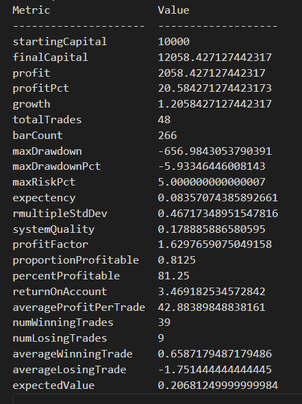
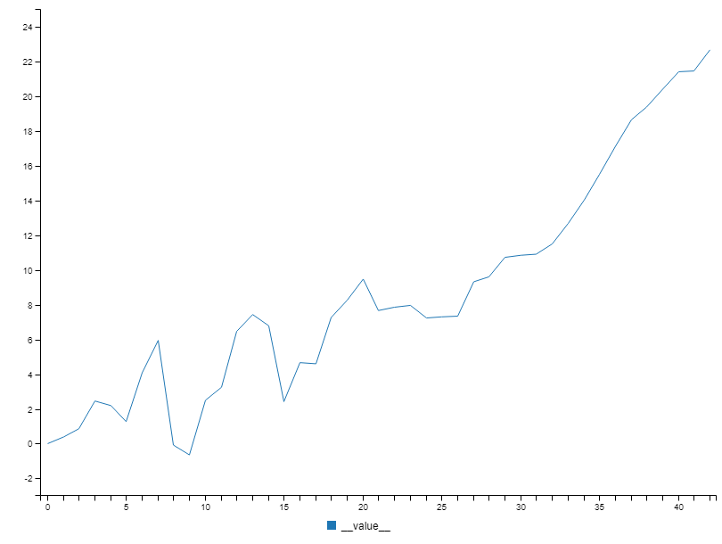
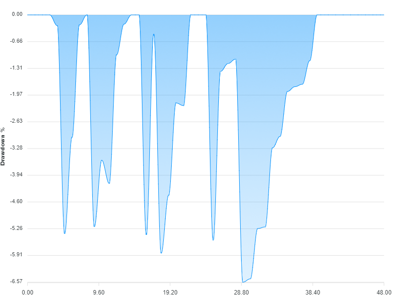

# grademark-first-example

This is an example trading strategy that demonstrates the [grademark API](https://github.com/ashleydavis/grademark) for backtesting financial trading strategies.

[Please click here to see this code as a notebook.](https://grademark.github.io/grademark-first-example/)

## Try it out

You need Node.js installed to run this.

Clone or download the repo.

Change to repo's directory and install dependencies:

    cd grademark-first-example
    npm install

Now run it:

    node index.js

Or

    npm start

You will see some stats printed to the console.

Inspect the `output` sub-directory for charts. 

## Examples of output

Here's a screenshot of the analysis:

Here's one of the charts that visualizes the equity curve:

Here's another chart, this is a visualization of the drawdown:

