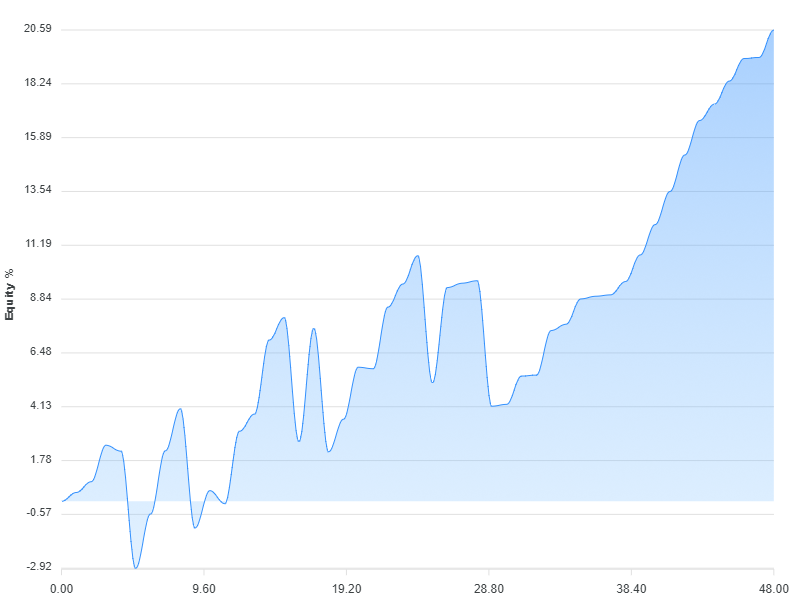

# Grademark first example

A first example of a trading strategy backtested using [Grademark](https://github.com/grademark/grademark).

[Click here to see this code as a notebook](https://grademark.github.io/grademark-first-example/)

[Click here to support my work](https://www.codecapers.com.au/about#support-my-work)

## Try it out

You need Node.js installed to run this.

Clone or download the repo.

Change to repo's directory and install dependencies:

```bash
cd grademark-first-example
npm install
```

Now run it:

```bash
node index.js
```

Or

```bash
npm start
```

You will see some stats printed to the console.

Inspect the `output` sub-directory for charts. 

## Examples of output

Here's a screenshot of the analysis:


Here's one of the charts that visualizes the equity curve:



Here's another chart, this is a visualization of the drawdown:


